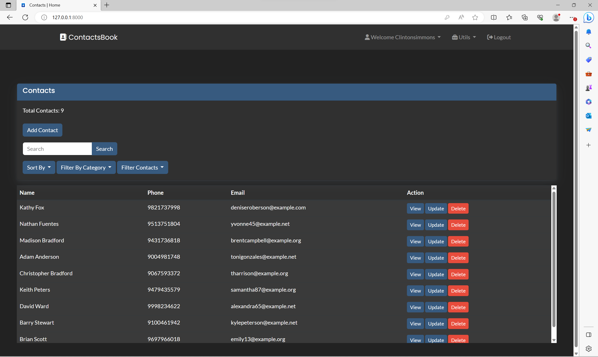
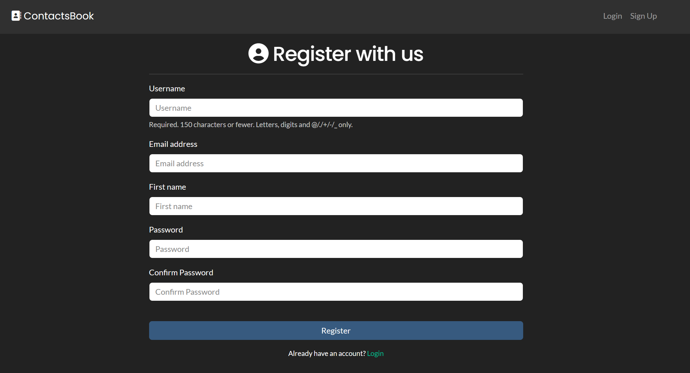

# Contacts App - Django Contact Management

The Contacts App is a feature-rich web application built using Django, designed to streamline contact management efficiently. With an intuitive user interface and advanced features, this app allows users to organize, categorize, and maintain their contacts seamlessly.

## Features

- **User-friendly Interface:** The Contacts App uses Bootstrap and offers a simple and intuitive user interface, making it easy for users to navigate and manage contacts efficiently.

- **Contact Details:** Add comprehensive details for each contact, such as first and last names, phone numbers, email addresses, addresses, company names, birthdays, and more.

- **Categorization:** Categorize contacts based on their roles and relationships, allowing quick access and efficient organization.

- **Filter by Favourites:** Easily view contacts who are marked as favourites.

- **Filter by Birthday:** Easily view contacts whose birthdays are today.

- **Import and Export Csv:** Import and Export Contacts From and To Csv File.

- **Profile Pictures:** Personalize the contact list by uploading profile pictures for each contact.

- **Validation:** Robust validation mechanisms ensure data integrity, prompting users for correct input of phone numbers, email addresses, and birthdays.

- **Change Password:** Users can update their account passwords securely.

## Screenshots
**Home Page**

**SignUp Page**


## Getting Started

To set up and run the Contacts App on your local machine, follow the steps below:

### Prerequisites

- Python 3.x

### Installation

1. Clone the repository to your local machine and Change Directory:

```
git clone https://github.com/VaishnavSherla/Contacts-App.git
cd Contacts-App
```
2. Create Virtual Env and Install Requirements:

```
python -m venv env
env\Scripts\activate  # On Windows
source env/bin/activate  # On macOS/Linux
pip install -r requirements.txt
```
### Database Setup and Admin Access

1. **Set up the database:**

   Run the following commands to apply the necessary migrations:

   ```
   python manage.py makemigrations
   python manage.py makemigrations ContactsApp
   python manage.py migrate
   ```

2. **Create a superuser for admin access:**

   ```
   python manage.py createsuperuser
   ```

3. **Run the development server:**

   Start the development server with the following command:

   ```
   python manage.py runserver
   ```

4. **Access the admin panel:**

   Go to `http://127.0.0.1:8000/admin/` in your web browser and log in using the superuser credentials.

5. **Create a user profile:**

   In the "Profiles" section of the admin panel, create a new profile for the superuser by providing the necessary details and saving the profile.

6. **Access the site using admin credentials:**

   After creating the user profile, you can access the site using the admin credentials and the associated user profile.

Now you're all set to manage and use the Contacts App for efficient contact management!

### Generate Sample Data (Optional)
This command will generate sample data which create user accounts with username and password that are the same. 

This means that the generated username will also be used as the password for each corresponding user account.

If you want to populate the database with sample data for testing, use the following command:

```
python manage.py generatedata
```
### Feedback
For feedback or any inquiries, feel free to contact and connect with me on LinkedIn:
[LinkedIn](https://www.linkedin.com/in/vaishnav-sherla/)
